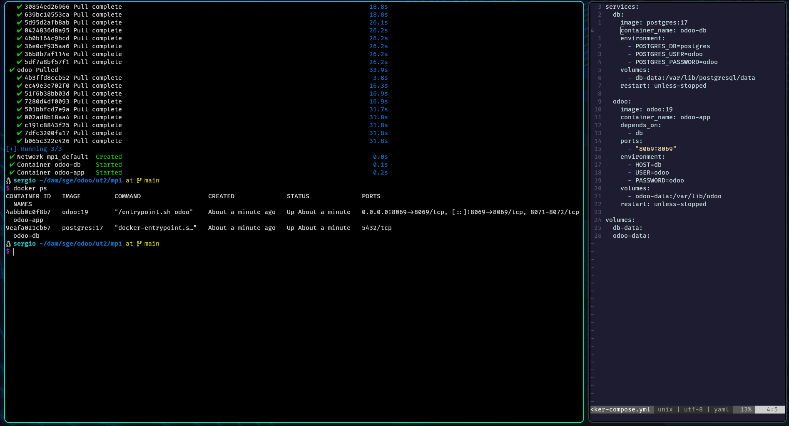
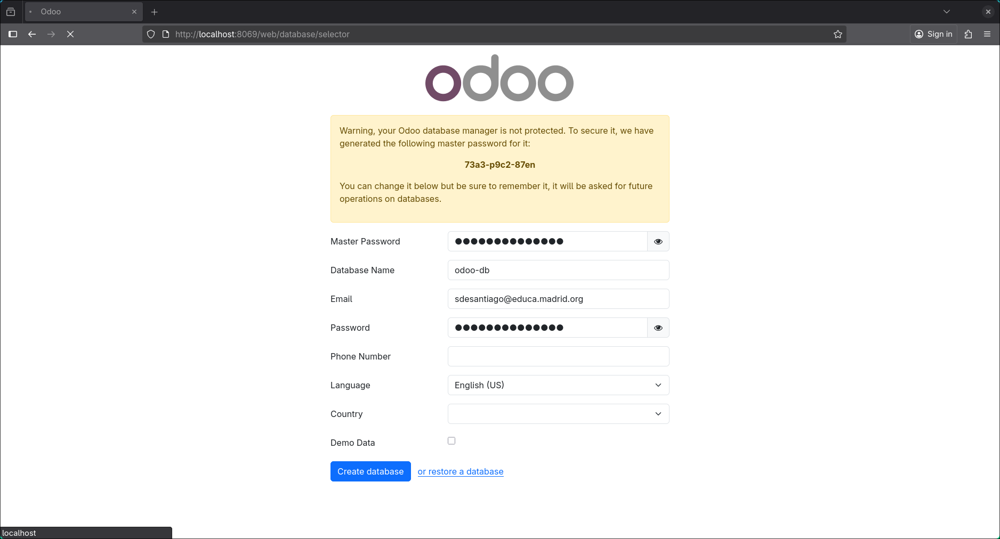
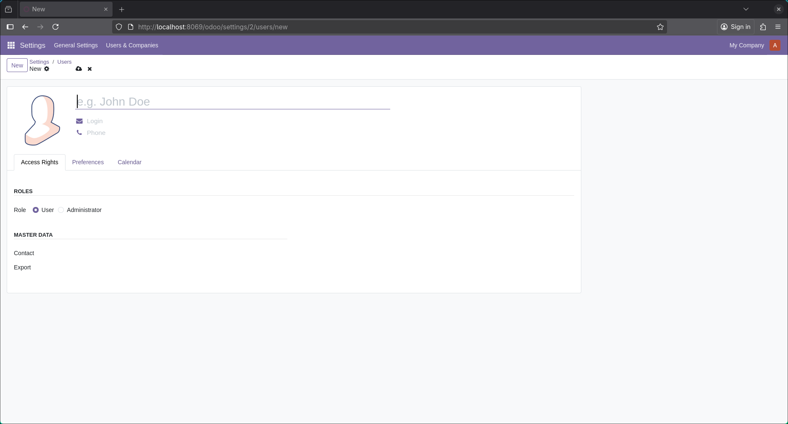
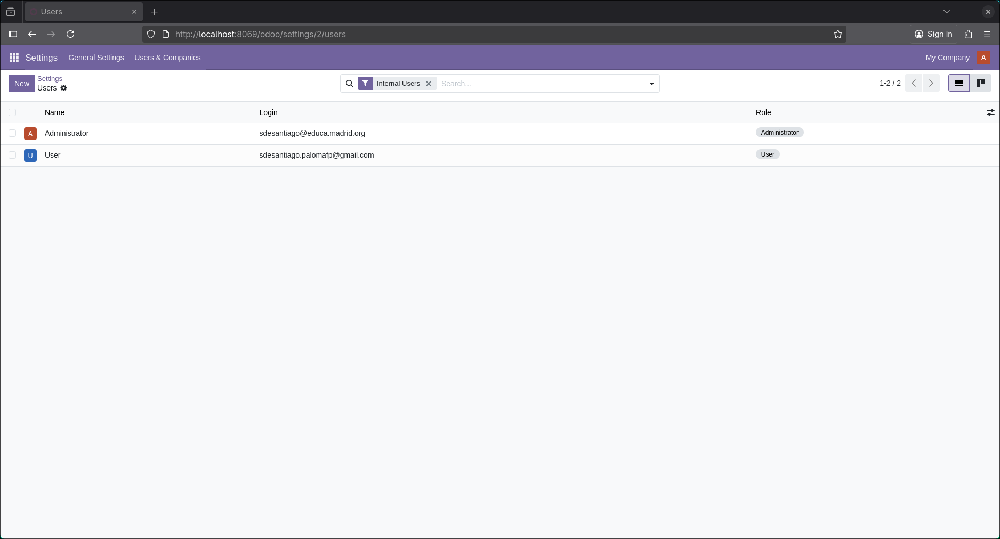
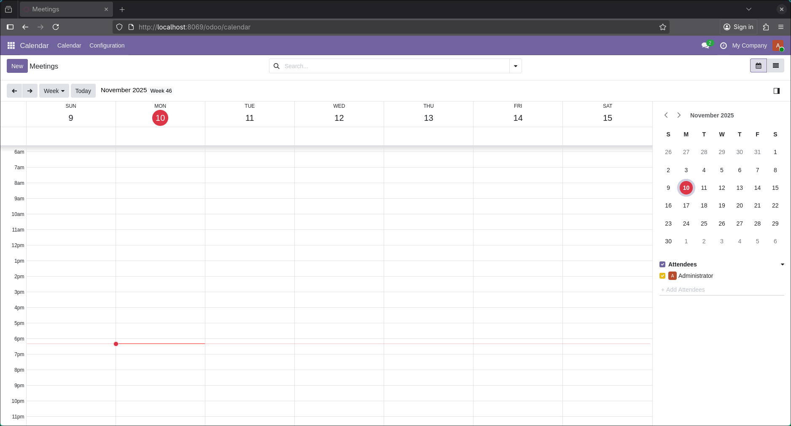
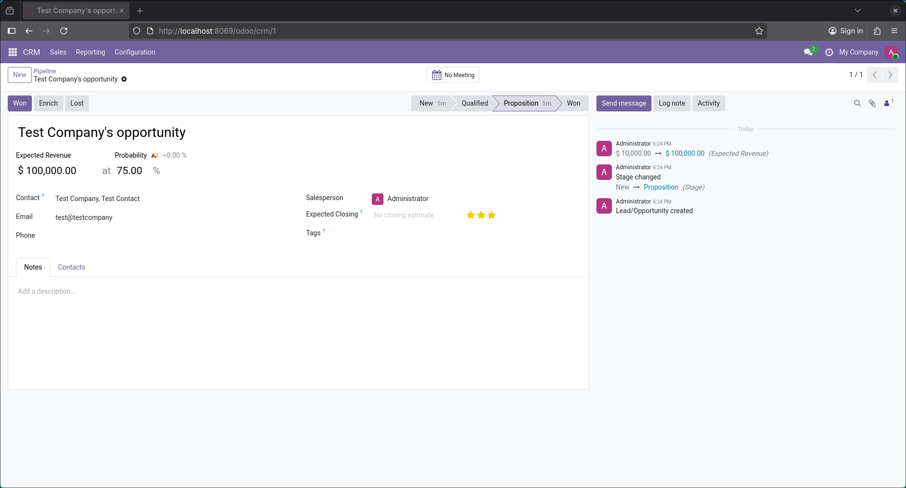
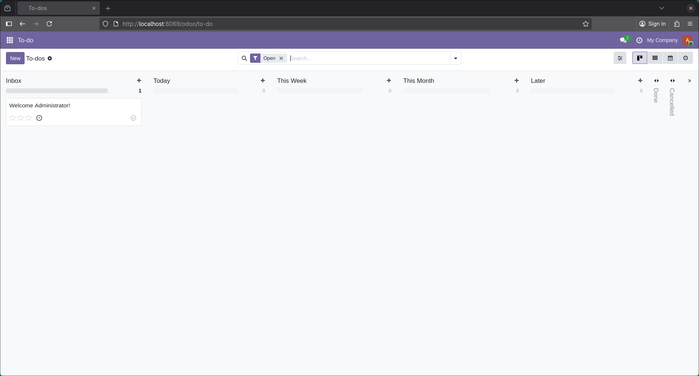

# Despliegue de Odoo con Docker Compose

## Prerrequisitos

- Docker instalado
- Docker Compose instalado
```bash
sudo pacman -S docker docker-compose
```

## Pasos de Configuración

1. **Crear el archivo [docker-compose.yml](./docker-compose.yml)**

2. **Desplegar el stack:**
```bash
docker-compose up -d
```


3. **Acceder a Odoo:**
- Abrir el navegador y navegar a `http://localhost:8069`
- Crear la base de datos

- Crear los usuarios:


- Añadir los módulos:
  - Calendario:
  
  - CRM:
  
  - Lista de tareas:
  
  - Web:
  

## Comandos de Gestión

- **Detener servicios:** `docker compose down`
- **Ver logs:** `docker compose logs`
- **Actualizar imágenes:** `docker compose pull && docker compose up -d`
